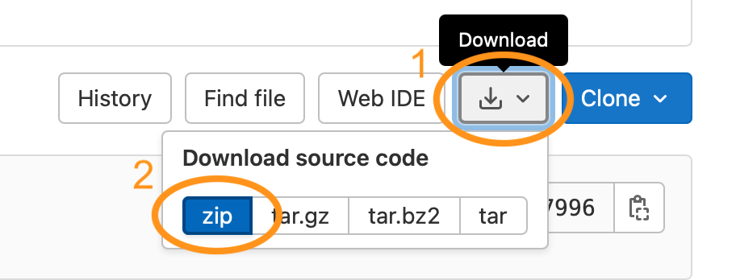
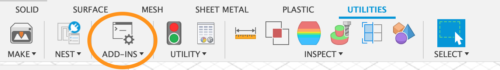
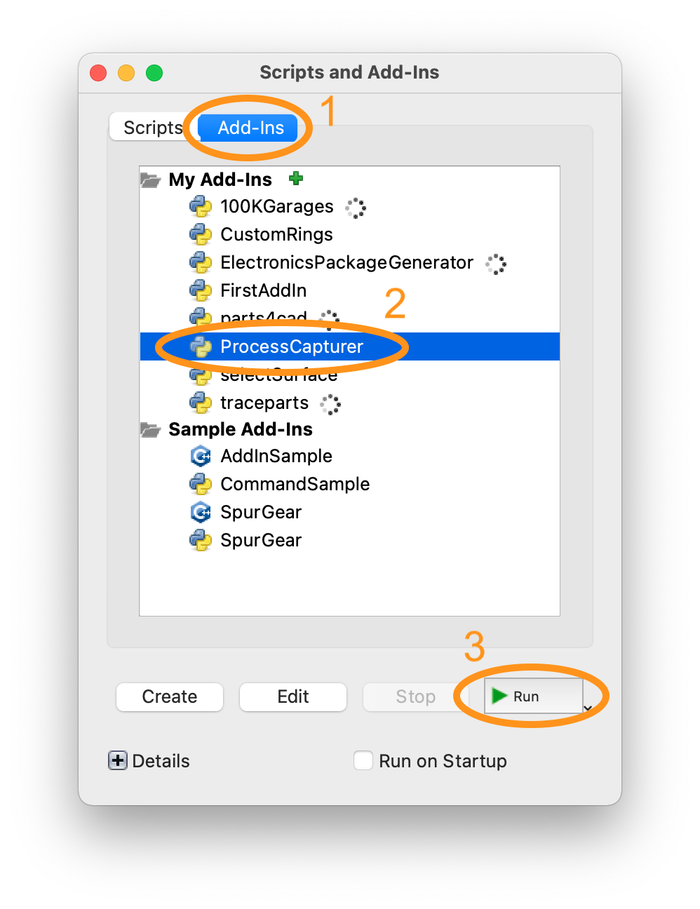
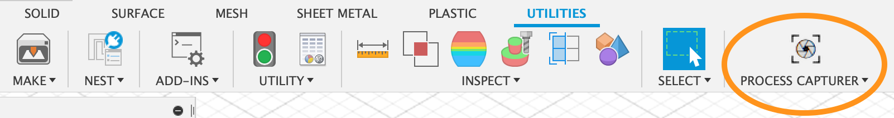
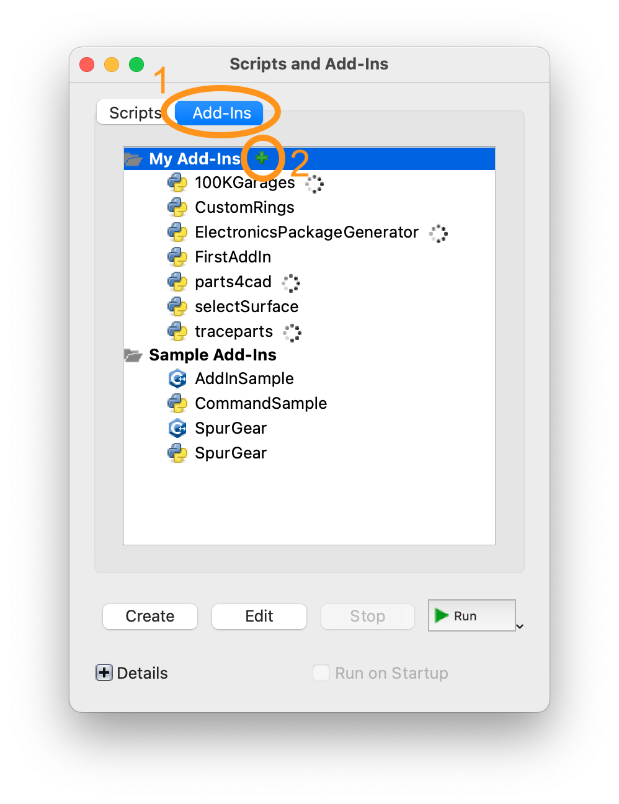
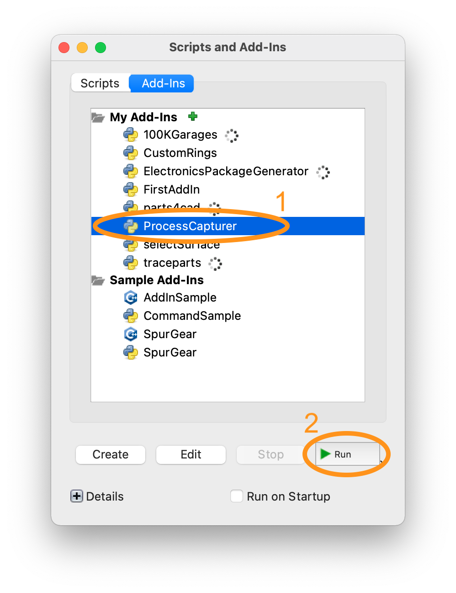

# ProcessCapturer

ProcessCapturer is a Fusion360 add-in which captures your created models and then converts them into images and video. Steps details can be shown on the generated media files which help illustrate the creation process. The add-in provides full functionalities on Windows and hence it is suggested to use it on Windows. Limited features are available on MacOS.

&nbsp;

> Features of adding step details and generating video are only available on the Windows version.
\
Due to the use of the external OpenCV library in ProcessCapturer, which is not functioning with Fusion 360 on MacOS unless explicitly installed locally, our add-in behaves adaptively with different functionalities on both platforms: 
\
**Running on Windows**: It is able to take snapshots from the users' design and then create a video out of these images, with step description texts displayed on each frame if desired. \
**Running on MacOS**: Only taking snapshots with no special text added are available. 
\
For details please refer to our [user manual](manual.pdf).

&nbsp;

## Installation

ProcessCapturer runs on both Windows and MacOS devices. The installation procedures on both platforms are the same. Please download the ProcessCapturer source folder from before proceeding.

Click “Download” → “zip” to download the source folder.

&nbsp;

After downloading the source folder to your computer locally, please follow either method below to install the add-in in Fusion 360.

### Method 1

**Step 1**: Unzip the downloaded file and place the ProcessCapturer folder in the below path according to your operating platforms: 

_**Windows**_: `${%appdata%\Autodesk\Autodesk Fusion 360\API\AddIns}`

_**MacOS**_: `${$HOME/Library/Application Support/Autodesk/Autodesk Fusion 360/
API/AddIns}`

**Step 2**: Open Fusion360 and click “ADD-INS” under the UTILITIES tab to open the add-in dialog.

&nbsp;

**Step 3**: In the add-in dialog, click “Add-Ins”. You should be able to see that ProcessCapturer has been added to your list of add-ins. Select it and click “Run” at the bottom.

&nbsp;

**Step 4**: If a new panel named ProcessCapturer has been added under the UTILITIES tab, the installation and activation of the add-in are successful.

&nbsp;

### Method 2

If you did not place the unzipped folder in the directory stated in Method 1, you may still install the add-in to Fusion360 by the following:

**Step 1**: Unzip the downloaded file and place the ProcessCapturer folder in your desired directory. 

**Step 2**: Open Fusion360 and click “ADD-INS” under the UTILITIES tab to open the add-in dialog.

&nbsp;

**Step 3**: In the add-in dialog, click “Add-Ins”. Then click on the green “+” button to select the directory that you placed the ProcessCapturer folder in.

&nbsp;

**Step 4**: After selecting the correct folder, a new item ProcessCapturer should be displayed in the list of add-ins. Select it and click “Run” at the bottom.

&nbsp;

**Step 5**: If a new panel named ProcessCapturer has been added under the UTILITIES tab, the installation and activation of the add-in are successful.

&nbsp;

 
> If you encounter any problems during the installation process, please refer to the [official instructions provided by Fusion360].

[official instructions provided by Fusion360]: <https://help.autodesk.com/view/fusion360/ENU/?guid=GUID-9701BBA7-EC0E-4016-A9C8-964AA4838954>
